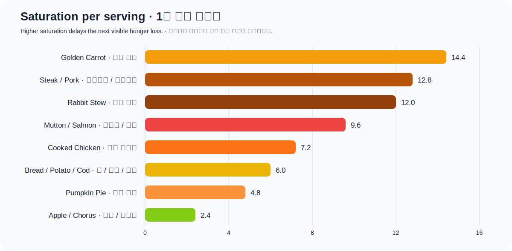

# Food and hunger

This guide targets **Minecraft Java Edition 26.1 on Paper**. Two food points are
one visible drumstick. `Saturation` is a hidden reserve consumed before the
visible food bar decreases.

## Hunger and saturation

- Food and saturation each cap at 20; saturation cannot exceed current food.
- Sprinting, jumping, swimming, mining, attacking, and natural healing build
  exhaustion. Exhaustion drains saturation first, then food.
- At food 18 or higher, health can regenerate when `naturalRegeneration=true`.
  High saturation makes the initial healing faster.
- At food 6 or lower, the player cannot begin sprinting. At zero, starvation
  damage stops at health 10 on Easy and health 1 on Normal; Hard can kill.
- When nearly full, high-saturation food is more efficient than merely choosing
  the largest visible food refill.

## Food values

Soups return a bowl but stack only one per slot, making them poor travel food.
Eating fish from its bucket uses the same food values as the loose fish, but is
rarely sensible.

| Food | Food | Saturation | Note |
|---|---:|---:|---|
| Golden Carrot | 6 | 14.4 | Extremely high saturation for a stackable ordinary food |
| Steak | 8 | 12.8 | High food/saturation and stacks to 64 |
| Cooked Porkchop | 8 | 12.8 | Same values as Steak |
| Cooked Mutton | 6 | 9.6 | Strong midgame food |
| Cooked Salmon | 6 | 9.6 | Renewable through fishing and fisherman trades |
| Rabbit Stew | 10 | 12.0 | Large single refill but unstackable |
| Beetroot Soup | 6 | 7.2 | Unstackable |
| Mushroom Stew | 6 | 7.2 | Unstackable |
| Suspicious Stew | 6 | 7.2 | Edible while full; flower-specific effect |
| Cooked Chicken | 6 | 7.2 | Safe livestock food |
| Bread | 5 | 6.0 | Convenient early farm/farmer-trade food |
| Baked Potato | 5 | 6.0 | Pairs well with potato automation |
| Cooked Cod | 5 | 6.0 | Common fish food |
| Cooked Rabbit | 5 | 6.0 | Rabbit Stew ingredient |
| Pumpkin Pie | 8 | 4.8 | High visible food, modest saturation |
| Golden Apple | 4 | 9.6 | Edible while full; Regeneration II 5s + Absorption I 2m |
| Enchanted Golden Apple | 4 | 9.6 | Regeneration II 20s, Resistance I/Fire Resistance 5m, Absorption IV 2m |
| Apple | 4 | 2.4 | Golden Apple ingredient |
| Chorus Fruit | 4 | 2.4 | Edible while full; random teleport up to 8 blocks |
| Honey Bottle | 6 | 1.2 | Edible while full; removes Poison; stacks to 16 |
| Carrot | 3 | 3.6 | No cooking and used for Golden Carrots |
| Raw Beef/Porkchop/Rabbit | 3 | 1.8 | Cooking is much more efficient |
| Raw Mutton | 2 | 1.2 | Greatly improved by cooking |
| Melon Slice | 2 | 1.2 | Glistering Melon/potion ingredient |
| Beetroot | 1 | 1.2 | Better for soup or selling |
| Raw Chicken | 2 | 1.2 | 30% chance of Hunger for 30s |
| Raw Cod/Salmon | 2 | 0.4 | Cooking improves efficiency |
| Cookie | 2 | 0.4 | Low saturation; fatally poisonous to parrots |
| Glow/Sweet Berries | 2 | 0.4 | Easy farming but inefficient travel staples |
| Dried Kelp | 1 | 0.6 | Very fast to eat, very small refill |
| Potato | 1 | 0.6 | Bake before eating |
| Tropical Fish | 1 | 0.2 | More useful for collection and Axolotls |

A placed Cake has seven slices. Each gives food 2 and saturation 0.4, totaling
14 and 2.8, but cake cannot be carried while eating or recovered after placement.

## Dangerous food

| Food | Values | Added effect |
|---|---|---|
| Rotten Flesh | 4 / 0.8 | 80% chance of Hunger for 30s; sell to a Cleric unless desperate |
| Poisonous Potato | 2 / 1.2 | 60% chance of Poison for 5s |
| Spider Eye | 2 / 3.2 | Always Poison for 5s; save for brewing |
| Pufferfish | 1 / 0.2 | Poison II 60s, Hunger III 15s, Nausea 15s |
| Raw Chicken | 2 / 1.2 | 30% chance of Hunger for 30s |

Poison normally cannot reduce health below 1, but overlapping damage remains
dangerous. Honey clears Poison only; milk clears other effects too.

## Suspicious-stew flowers

The item name does not reveal its effect. Remember the crafting flower or keep
variants in separate storage. Durations are Java 26.1 values.

| Flower | Effect |
|---|---|
| Dandelion, Golden Dandelion, Blue Orchid | Saturation for 0.35s (instant food/saturation restoration) |
| Allium | Fire Resistance 3s |
| Azure Bluet, Open Eyeblossom | Blindness 11s |
| Closed Eyeblossom | Nausea 7s |
| Cornflower | Jump Boost 5s |
| Lily of the Valley | Poison 11s |
| Red/Orange/Pink/White Tulip | Weakness 7s |
| Oxeye Daisy | Regeneration 7s |
| Poppy, Torchflower | Night Vision 5s |
| Wither Rose | Wither 7s |

Feeding a flower to a brown Mooshroom and using a bowl also produces one stew
with that flower's effect.

## Recommendations

- Everyday/travel: Golden Carrots, Steak, or Cooked Porkchops.
- Farm progression: begin with Bread or Baked Potatoes, then buy renewable Golden
  Carrots from a Master Farmer.
- Combat: carry Golden Apples in a separate slot; eat them for effects, not hunger.
- Emergency Rotten Flesh: minimize unnecessary sprinting and jumping while the
  Hunger debuff is active.
- Nether/End: combine high-saturation stackable food with situational
  [potions](brewing.md).

## Research baseline

- [Minecraft 26.1 generated food values and effects](https://github.com/misode/mcmeta/blob/26.1-summary/item_components/data.json)
- [Minecraft 26.1 generated suspicious-stew recipes](https://github.com/misode/mcmeta/tree/26.1-data-json/data/minecraft/recipe)
- [Official Minecraft health and food guide](https://www.minecraft.net/en-us/article/health-minecraft)
- [Minecraft Java Buzzy Bees: honey removes Poison](https://www.minecraft.net/en-us/article/buzzy-bees-out-now-in-java)
