# 양조법

이 문서는 **Minecraft Java Edition 26.1 / Paper**의 바닐라 양조법입니다. 포션 이름이
아니라 효과 자체를 찾는다면 [상태 효과](status-effects.md)를 참고하세요.

## 양조대 준비

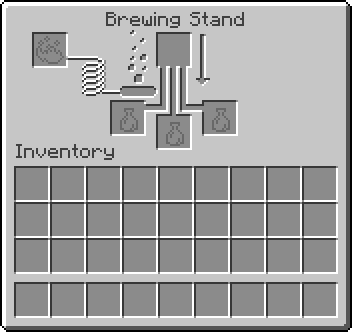

1. 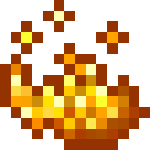 양조대 왼쪽 칸에 **블레이즈 가루**를 넣어 연료를 채웁니다. 한 가루는 20번의
   양조 작업을 처리하며, 한 작업은 아래 세 병을 동시에 처리할 수 있습니다.
2. 유리병에 물을 담아 아래쪽 병 칸에 놓습니다.
3. 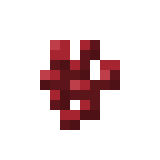 대부분은 물병에 **네더 사마귀**를 넣어 어색한 물약을 먼저 만듭니다.
4. 위쪽 재료 칸에 효과 재료를 넣고, 필요하면 변형 재료를 추가로 양조합니다.

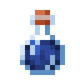 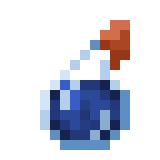 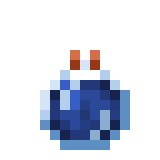

이 가이드의 아이템 이미지는 **마시는 포션 · 투척용 포션 · 잔류형 포션** 순서입니다.

양조대는 블레이즈 막대 1개와 아무 돌 계열 블록 3개로 제작합니다. 가마솥 하나는
Java Edition에서 물병 세 개를 채우므로, 자동화가 아니라면 무한 물 공급원이 더
편리합니다.

## 기본 포션 표

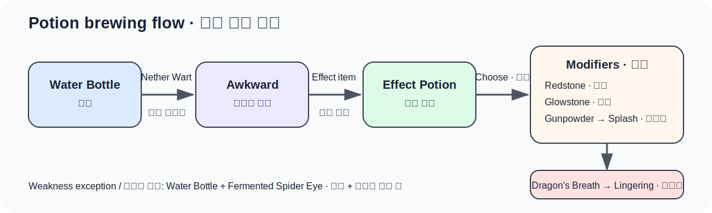

`기본 / 연장 / 강화`는 마시는 포션의 지속 시간입니다. `—`는 해당 변형이 없다는
뜻입니다.

| 결과 (English) | 어색한 물약에 넣는 재료 | 기본 | 레드스톤 연장 | 발광석 강화 |
|---|---|---:|---:|---:|
|  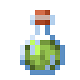  야간 투시 (Night Vision) | 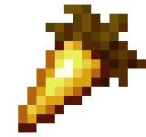 황금 당근 | 3:00 | 8:00 | — |
| 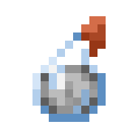 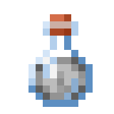 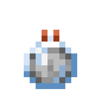 투명화 (Invisibility) | 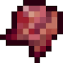 야간 투시+발효된 거미 눈 | 3:00 | 8:00 | — |
| 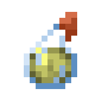 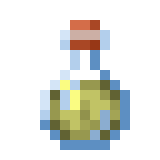 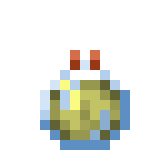 도약 (Leaping) | 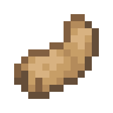 토끼발 | 3:00 | 8:00 | II 1:30 |
| 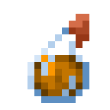 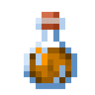 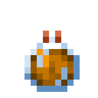 화염 저항 (Fire Resistance) | 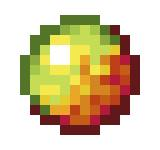 마그마 크림 | 3:00 | 8:00 | — |
| 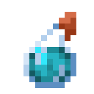  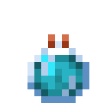 신속 (Swiftness) | 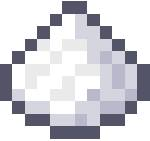 설탕 | 3:00 | 8:00 | II 1:30 |
| 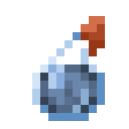  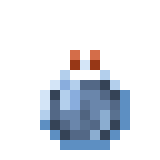 감속 (Slowness) |  신속 또는 도약+발효된 거미 눈 | 1:30 | 4:00 | IV 0:20 |
| 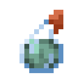 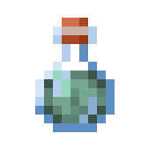 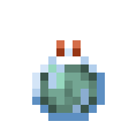 수중 호흡 (Water Breathing) | 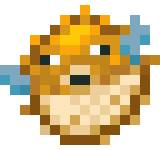 복어 | 3:00 | 8:00 | — |
| 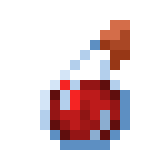 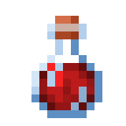 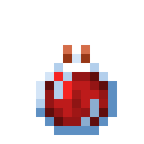 치유 (Healing) | 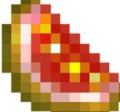 반짝이는 수박 조각 | 즉시 4 체력 | — | II: 즉시 8 체력 |
| 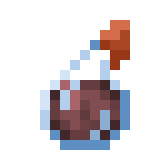 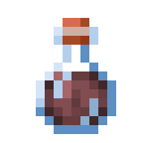 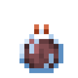 고통 (Harming) |  치유 또는 독+발효된 거미 눈 | 즉시 6 피해 | — | II: 즉시 12 피해 |
| 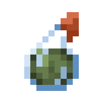 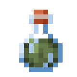 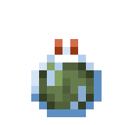 독 (Poison) | 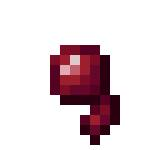 거미 눈 | 0:45 | 1:30 | II 0:21 |
| 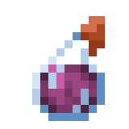 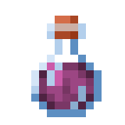 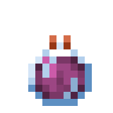 재생 (Regeneration) | 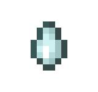 가스트 눈물 | 0:45 | 2:00 | II 0:22 |
| 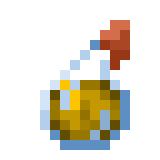 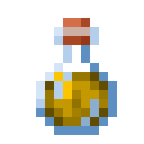 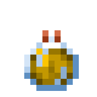 힘 (Strength) |  블레이즈 가루 | 3:00 | 8:00 | II 1:30 |
| 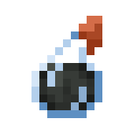 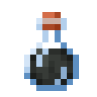  나약함 (Weakness) |  **물병**+발효된 거미 눈 | 1:30 | 4:00 | — |
|    거북 도사 (Turtle Master) |  거북 등딱지 | 0:20 | 0:40 | II 0:20 |
|    느린 낙하 (Slow Falling) |  팬텀 막 | 1:30 | 4:00 | — |
|    벌레 먹음 (Infested) |  돌 | 3:00 | — | — |
|    점액화 (Oozing) |  슬라임 블록 | 3:00 | — | — |
|    방적 (Weaving) |  거미줄 | 3:00 | — | — |
|    돌풍 (Wind Charged) |  브리즈 막대 | 3:00 | — | — |

거북 도사의 물약은 기본적으로 `속도 감소 IV + 저항 III`, 강화형은 `속도 감소 VI +
저항 IV`를 함께 줍니다. 방어력은 높지만 이동이 매우 느려지므로 전투 전에 용도를
정하고 사용하세요.

### 크리에이티브 전용 포션

  

행운의 물약은 Java Edition에 존재하지만 양조법이나 생존 획득 경로가 없습니다.
베드락 전용 부패의 물약은 이 Java/Paper 가이드에서 제외했습니다.

## 변형 재료

| 재료 | 변환 | 주의점 |
|---|---|---|
|  레드스톤 가루 | 지원되는 포션의 지속 시간 연장 | 강화형과 동시에 만들 수 없습니다. |
|  발광석 가루 | 지원되는 포션의 효과 단계 강화 | 지속 시간이 짧아지며 연장형과 동시에 만들 수 없습니다. |
|  발효된 거미 눈 | 효과 반전·변질 | 야간 투시→투명화, 신속/도약→감속, 치유/독→고통, 물병→나약함 |
|  화약 | 마시는 포션→투척용 포션 | 충돌 지점에서 범위 적용; 중심에 맞을수록 지속 시간이 깁니다. |
|  드래곤의 숨결 | 투척용→잔류형 포션 | 바닥에 효과 구름을 만들며, 개체가 받는 기본 지속 시간은 원래 포션의 1/4입니다. |

순서상 레드스톤·발광석·발효된 거미 눈으로 원하는 효과를 먼저 완성한 다음 화약과
드래곤의 숨결을 넣는 편이 실수를 줄입니다.

## 쓸모 없는 기초 물약

- 평범한 물약(Mundane): 물병에 레드스톤 등 일부 재료를 먼저 넣으면 생기며 효과가
  없습니다.
- 진한 물약(Thick): 물병에 발광석 가루를 먼저 넣으면 생기며 효과가 없습니다.
- 어색한 물약(Awkward): 자체 효과는 없지만 대부분의 유효 포션의 기반입니다.

평범한·진한·어색한 물약은 물병과 같은 병 이미지를 사용합니다. 별도 실루엣이 아니라
아이템 이름과 양조 데이터로 구분됩니다.

잘못 만든 평범한·진한 물약을 유효 포션으로 되돌리는 일반 양조법은 없습니다.

## 실전 추천

- 네더: 화염 저항 8:00. 용암에 빠진 뒤 인벤토리를 열기보다 핫바에 둡니다.
- 바다·해저 유적: 수중 호흡 8:00 + 야간 투시 8:00.
- 엔드 도시: 느린 낙하 4:00. 셜커 공중 부양 종료 뒤 낙사를 막습니다.
- 보스전: 힘 II, 재생 II 또는 긴 재생, 즉시 치유 II.
- 좀비 주민 치료: 투척용 나약함을 맞힌 뒤 일반 황금 사과를 사용합니다. 마법이
  부여된 황금 사과가 아닙니다.
- 몹 농장: 점액화·벌레 먹음·방적은 추가 몹이나 블록을 만들 수 있으므로 서버 부하와
  탈출 경로를 먼저 통제합니다.

## 안전 메모

- 포션을 다시 마셔도 남은 시간이 더해지지 않고 새 포션 시간으로 교체됩니다.
- 같은 효과의 더 강한 단계가 우선하며, 끝난 뒤 약한 효과의 남은 시간이 다시 나타날
  수 있습니다.
- 즉시 치유와 고통은 언데드에게 반대로 작동합니다.
- 투척용 포션은 아군과 본인을 함께 맞힐 수 있습니다. 직접 맞히면 가장 긴 효과를
  주며 멀수록 짧아집니다.

## 조사 기준

- [Minecraft 공식 투척용 포션 안내](https://www.minecraft.net/en-us/article/how-brew-and-use-splash-potions)
- [Minecraft 24w13a 신규 포션 재료](https://www.minecraft.net/en-us/article/minecraft-snapshot-24w13a)
- [Minecraft Java Edition 1.21 릴리스 노트](https://feedback.minecraft.net/hc/en-us/articles/27547857163917-Minecraft-Java-Edition-1-21-Tricky-Trials)
- [Minecraft 26.1 포션 레지스트리](https://github.com/misode/mcmeta/blob/26.1-summary/registries/data.json)
