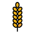
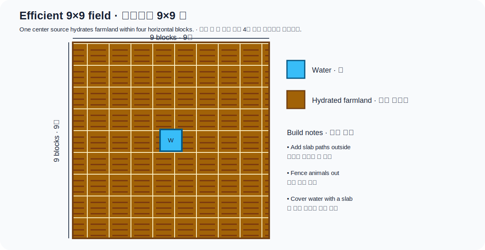
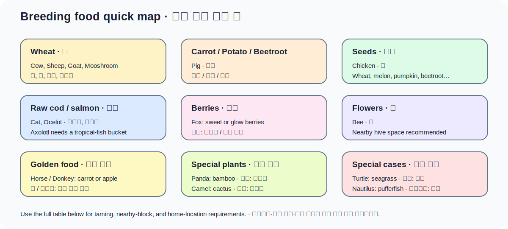

# 농사와 사육

이 문서는 **Minecraft Java Edition 26.1 / Paper** 기준입니다. 작물은 청크가 로드되어
무작위 틱을 받을 때 자라고, 동물은 너무 많이 모으면 Raspberry Pi 서버의 개체 AI와
충돌 계산 비용을 높입니다.

## 밭의 기본 조건

- 괭이로 흙이나 잔디 블록을 갈아 경작지를 만듭니다.
- 물은 경작지와 같은 높이 또는 한 칸 위에서 수평 4블록 안에 있으면 경작지를
  적십니다. 물 한 칸으로 9×9 밭을 적실 수 있습니다.
- 밀·당근·감자·비트는 작물 위치의 밝기가 9 이상이어야 자랍니다.
- 경작지 위에서 점프하거나 떨어지면 흙으로 돌아갈 수 있습니다. 통로에 반 블록을
  놓거나 울타리로 동물을 막으세요.
- 기본 `randomTickSpeed=3`에서 성장 시간은 무작위입니다. 서버 성능 때문에 이 값을
  크게 올리지 마세요.
- 같은 작물을 빽빽하게 심어도 자라지만, 서로 다른 줄을 번갈아 심으면 성장 판정에
  유리합니다.

## 작물별 조건

| 작물·자원 | 심는 곳 | 수확과 다시 심기 | 뼛가루 |
|---|---|---|---|
| 밀 | 경작지에 밀 씨앗 | 완전히 노랗게 익었을 때 밀+씨앗 | 가능 |
| 당근 | 경작지에 당근 | 주황 뿌리가 크게 보일 때 일부를 다시 심음 | 가능 |
| 감자 | 경작지에 감자 | 익으면 일부를 다시 심음; 독이 있는 감자는 심지 못함 | 가능 |
| 비트 | 경작지에 비트 씨앗 | 비트+씨앗, 다른 기본 작물보다 단계가 적음 | 가능 |
| 호박·수박 | 경작지에 씨앗 | 줄기는 남고 옆의 흙/잔디/경작지 등에 열매 생성; 옆 한 칸을 비움 | 줄기에 가능 |
| 사탕수수 | 물에 바로 인접한 흙·모래 등 | 자연 높이 3; 아래 한 칸을 남기고 위만 수확 | Java에서는 불가 |
| 선인장 | 모래·붉은 모래 | 자연 높이 3; 옆 네 방향에 블록이 있으면 파괴됨 | 불가 |
| 대나무 | 흙·모래·이끼 등 | 높게 자라며 아래를 남기고 수확 | 가능 |
| 코코아 콩 | 정글나무 원목 옆면 | 큰 갈색 꼬투리에서 3개 수확 | 가능 |
| 네더 사마귀 | 영혼 모래 | 붉고 큰 마지막 단계에서 2~4개; 물·밝기 불필요 | 불가 |
| 켈프 | 물속 블록 윗면 | 수면 아래 일부를 남기고 위를 수확 | 가능 |
| 달콤한 열매 | 흙·잔디·회백토 등 | 성숙 덤불을 우클릭; 이동 중 가시 피해 주의 | 가능 |
| 발광 열매 | 블록 아랫면의 동굴 덩굴 | 열매가 열린 덩굴을 우클릭; 가위로 성장 정지 가능 | 가능 |
| 버섯 | 낮은 밝기의 적합 블록; 균사체·회백토는 밝기 제약 완화 | 천천히 퍼짐; 충분한 공간에서 거대 버섯로 성장 | 거대화 가능 |
| 후렴과 | 엔드 돌 위 후렴화 | 꽃이 자라 줄기 생성; 아래쪽을 부수면 한꺼번에 수확 | 제한적 |
| 횃불꽃 | 경작지에 횃불꽃 씨앗 | 스니퍼가 찾은 씨앗; 완전히 자라도 씨앗을 추가로 복제하지 않음 | 가능 |
| 벌레잡이풀 | 경작지에 벌레잡이풀 꼬투리 | 두 블록 높이로 성장; 스니퍼가 꼬투리를 찾음 | 가능 |

호박·수박 자동 농장은 관측기와 피스톤이 자주 작동합니다. 작은 서버에서는 필요한
생산량만 만들고, 수확물을 물길로 모아 호퍼 수를 줄이는 편이 좋습니다.

## 번식 공통 규칙

- 번식 가능한 성체 두 마리에게 맞는 먹이를 주면 사랑 모드가 되고 새끼가 태어납니다.
- 대부분 번식 후 부모는 5분 동안 다시 번식하지 못하며, 새끼는 약 20분 뒤 성체가
  됩니다. 성장 먹이를 주면 남은 시간이 보통 10%씩 줄어듭니다.
- 길들여야 번식하는 동물, 주변 블록 조건이 필요한 동물, 태어난 곳이 아닌 고향에서
  알을 낳는 동물이 있습니다.

## 동물별 번식 먹이

| 동물 | 번식 먹이 | 추가 조건·결과 |
|---|---|---|
| 소·무시룸 | 밀 | 송아지; 무시룸끼리 번식 |
| 양 | 밀 | 부모 색 조합에 따라 새끼 색이 섞일 수 있음 |
| 염소 | 밀 | 일반/비명 염소 형질 확률 존재 |
| 돼지 | 당근·감자·비트 | 같은 먹이로 유인 가능 |
| 닭 | 밀/호박/수박/비트 씨앗, 횃불꽃 씨앗, 벌레잡이풀 꼬투리 | 달걀 부화와 번식은 별개 |
| 토끼 | 당근·황금 당근·민들레 | 부모 또는 지역 변종을 따름 |
| 말·당나귀 | 황금 당근·황금 사과 | 둘 다 길들인 성체여야 함 |
| 노새 | 길들인 말+당나귀 | 노새는 다시 번식하지 못함 |
| 라마·상인 라마 | 건초 더미 | 길들인 성체; 상인 라마도 주인과 분리 후 가능 |
| 늑대 | 고기·생선 | 길들인 늑대가 충분히 회복된 상태여야 함 |
| 고양이 | 생대구·생연어 | 길들인 고양이 두 마리 |
| 오셀롯 | 생대구·생연어 | 플레이어를 신뢰하는 상태에서 번식 가능; 고양이로 변하지 않음 |
| 여우 | 달콤한 열매·발광 열매 | 새끼는 번식시킨 플레이어를 신뢰하지만 길들인 펫은 아님 |
| 판다 | 대나무 | 각 부모 5블록 안에 대나무 블록이 충분히 있어야 함 |
| 벌 | 꽃 | 벌집 공간을 미리 확보; 벌은 수분 후 작물 성장을 촉진 |
| 거북 | 해초 | 한 부모가 자신의 고향 해변으로 돌아가 알을 낳음 |
| 호글린 | 진홍빛 균 | 뒤틀린 균·네더 포털 등을 무서워하는 중에는 실패할 수 있음 |
| 스트라이더 | 뒤틀린 균 | 용암 밖에서는 떨고 느려짐 |
| 아홀로틀 | 열대어가 든 양동이 | 그냥 열대어 아이템은 안 됨; 파란 변종은 번식에서 희귀 |
| 개구리 | 슬라임볼 | 물에 개구리알→올챙이→지역 온도에 따른 변종 |
| 낙타 | 선인장 | 새끼 낙타 |
| 스니퍼 | 횃불꽃 씨앗 | 스니퍼 알을 떨어뜨림; 이끼 블록 위에서 더 빨리 부화 |
| 아르마딜로 | 거미 눈 | 위협받아 몸을 만 상태에서는 먹지 않음 |
| 앵무조개 | 복어 또는 복어가 든 양동이 | 길들이기와 번식에 사용; 육지에서는 질식 피해 |

## 먹일 수 있지만 번식하지 않는 경우

- 낙타 허스크는 토끼발, 좀비 말은 붉은 버섯을 먹을 수 있지만 언데드 탈것이라
  일반 동물처럼 번식하지 않습니다.
- 앵무새는 씨앗으로 길들이고 먹일 수 있지만 번식하지 않습니다. 쿠키는 앵무새에게
  치명적인 독이므로 절대 주지 마세요.
- 행복한 가스트는 눈덩이에 반응하지만 일반적인 두 성체 번식 방식은 없습니다.
- 노새는 먹이고 회복하거나 성장시킬 수 있지만 불임입니다.

## 26.1 황금 민들레

민들레 1개와 금 조각으로 만든 **황금 민들레**를 새끼 몹에게 사용하면 성장을
정지하거나 다시 시작할 수 있습니다. 아래 방향 초록 입자는 정지, 위 방향 입자는
재시작을 뜻합니다.

- 새끼 주민과 언데드 새끼 몹에는 사용할 수 없습니다.
- 성장 정지는 장식·동물원 용도입니다. 고기·가죽·양털 생산이 목적이면 성체가 되지
  않으므로 사용하지 마세요.
- 다시 사용하면 성장 타이머가 이어집니다.

## 벌과 수분

벌은 꽃에서 꽃가루를 묻힌 뒤 벌집으로 돌아가는 길에 밀·감자·당근·비트·호박 줄기·
수박 줄기·달콤한 열매 같은 작물 위를 지나면 성장 단계를 올릴 수 있습니다. 벌집에서
꿀을 안전하게 채취하려면 불이 붙은 모닥불을 아래에 두고, 벌집 자체를 옮길 때는
섬세한 손길 도구를 사용합니다.

## Pi 서버 친화적인 농장

- 한 우리에 수십~수백 마리를 쌓지 말고 종별로 필요한 번식 개체만 유지합니다.
- 떨어진 아이템, 광산 수레, 호퍼, 주민, 동물은 모두 틱 비용입니다. 자동 수거는 짧게
  작동하고 보관함이 가득 차면 멈추게 만드세요.
- 청크 로더나 상시 작동 클럭은 사용하지 않고, 플레이어가 근처에 있을 때만 생산하는
  규모로 시작합니다.
- 농장을 늘리기 전 `/도구`의 서버 점수와 관리자의 TPS/성능 패널을 비교합니다.

## 조사 기준

- [Minecraft Java Edition 26.1: 황금 민들레](https://feedback.minecraft.net/hc/en-us/articles/44551668333837-Minecraft-Java-Edition-26-1)
- [Minecraft Java Edition 1.21.11: 앵무조개 번식](https://www.minecraft.net/en-us/article/minecraft-java-edition-1-21-11)
- [Minecraft 26.1 생성 데이터: 동물 먹이 태그](https://github.com/misode/mcmeta/tree/26.1-data-json/data/minecraft/tags/item)
- [Caves & Cliffs Part I: 자수정·구리·발광 열매](https://www.minecraft.net/en-us/article/caves---cliffs--part-i-out-today-java)
