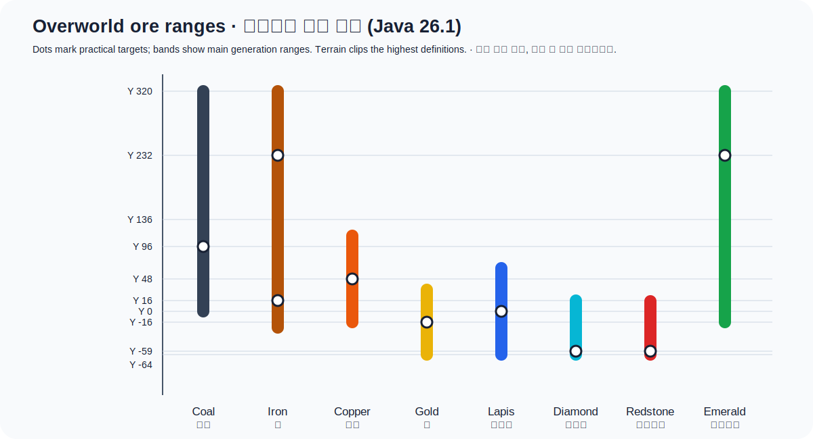

# 광물과 자원

이 문서는 **Minecraft Java Edition 26.1 / Paper** 기본 월드 생성 기준입니다. `Y`는
F3 디버그 화면의 높이 좌표입니다. 서버가 기존 월드를 업데이트했다면 이미 생성된
청크는 예전 지형을 유지하고, 새로 탐험한 청크부터 새 생성 규칙이 적용됩니다.

## 오버월드 광물 높이

`추천 Y`는 분포 정점과 채굴 안전성을 함께 고려한 실전 값입니다. 생성 범위 끝에서는
양이 0에 가까워질 수 있고, 석탄과 다이아몬드 등은 공기에 노출된 광맥이 줄어들므로
큰 동굴 벽만 보는 것보다 가지 채굴이 유리할 수 있습니다.

| 자원 | 주요 생성 범위·분포 | 추천 Y/장소 | 최소 곡괭이 | 행운 효과 |
|---|---|---|---|---|
| 석탄 | Y 0~192에서 Y 96 중심, Y 136 이상에도 풍부 | Y 96 또는 높은 산 | 나무 | 석탄 수량 증가 |
| 철 | Y -24~56에서 Y 16 중심, Y 80 이상은 높을수록 증가 | Y 16, 또는 높은 산 Y 232 부근 | 돌 | 철 원석 수량 증가 |
| 구리 | Y -16~112, Y 48 중심 | Y 48; 점적석 동굴은 대형 광맥 | 돌 | 구리 원석 수량 증가 |
| 금 | Y -64~32, Y -16 중심; Y -48 아래 추가 | Y -16; 악지 Y 32~256에 매우 풍부 | 철 | 금 원석 수량 증가 |
| 레드스톤 | Y 15 이하, Y -32 아래로 갈수록 증가 | 기반암을 피한 Y -59 | 철 | 가루 수량 증가 |
| 청금석 | Y -32~32에서 Y 0 중심 + 묻힌 광석 Y -64~64 | Y 0, 동굴 벽보다 매몰 광석도 탐색 | 돌 | 청금석 수량 증가 |
| 다이아몬드 | Y 16 아래, 낮을수록 증가; 공기 노출 감소 | 용암·기반암을 피한 Y -59 | 철 | 다이아몬드 수량 증가 |
| 에메랄드 | 산악 생물군계 Y -16 이상, Y 232 부근 중심 | 높은 산, 특히 Y 232 전후 | 철 | 에메랄드 수량 증가 |

높은 산의 실제 월드 상한은 보통 Y 320이므로 철·에메랄드 생성 정의의 더 높은 끝은
지형에서 잘립니다. `Y -59` 가지 채굴은 발 위치 기준이며, 바로 아래 용암을 피하려면
항상 앞쪽 두 블록을 번갈아 확인하세요.

## 대형 광맥과 생물군계 예외

- 대형 **철 광맥**은 깊은 지하의 응회암과 함께 나타납니다. 철 원석 블록(Raw Iron
  Block)이 보이면 주변 응회암을 따라가며 조사하세요.
- 대형 **구리 광맥**은 화강암과 함께 나타나며 Y 0 위쪽에서 찾기 쉽습니다. 점적석
  동굴에는 일반 구리 광맥도 더 큽니다.
- **악지(Badlands)**는 Y 32~256에 금이 대량 추가 생성됩니다.
- **산악 생물군계**만 에메랄드 광석을 자연 생성합니다. 거래가 대량 에메랄드 확보에는
  더 효율적입니다.
- 석탄은 Y 0 아래에 생성되지 않으므로 깊은 동굴에 들어가기 전에 횃불 연료를 챙깁니다.

## 네더 자원

| 자원 | 위치 | 최소 도구·채굴 팁 |
|---|---|---|
| 네더 석영 | 네더 Y 10~118 전역 | 나무 곡괭이; 행운으로 석영 증가, 경험치 공급에 좋음 |
| 네더 금광석 | 네더 Y 10~118 전역, 황무지에 더 많음 | 나무 곡괭이; 행운은 금 조각 증가, 섬세한 손길 뒤 제련하면 금괴 1개 |
| 고대 잔해 | 전역에 희박, Y 8~24 집중·Y 16 중심 | **다이아몬드 이상**; 폭발에 강하므로 Y 15 부근 침대/TNT 채굴 가능 |
| 발광석 | 천장 군집 | 아래 용암 확인; 행운은 가루를 늘리지만 블록당 최대 4개 |
| 네더 사마귀 | 네더 요새 계단 농장, 보루 일부 | 도구 불필요; 영혼 모래에 재배 |
| 블레이즈 막대 | 네더 요새의 블레이즈 | 양조 연료와 엔더의 눈에 필요; 화염 저항 준비 |

고대 잔해를 제련하면 네더라이트 파편이 되며, 파편 4개와 금괴 4개로 네더라이트
주괴 1개를 만듭니다. 장비 업그레이드에는 별도로 보루 잔해의 네더라이트 강화
대장장이 형판이 필요합니다.

## 행운과 섬세한 손길 선택

- 행운 III는 석탄·다이아몬드·에메랄드·청금석·레드스톤·석영과 철/구리/금 원석의
  산출량을 늘릴 수 있습니다.
- 섬세한 손길은 광석 블록 자체를 보관합니다. 인벤토리를 압축하거나 나중에 행운 III로
  캐고 싶을 때 유용합니다.
- 행운과 섬세한 손길은 같은 도구에 정상적으로 함께 붙지 않습니다.
- 광석 블록 자체를 제련하면 대개 1개만 나오므로, 행운이 적용되는 광물을 제련해
  처리하면 손해입니다. 철·구리·금은 원석을 행운으로 캔 뒤 제련하세요.
- 고대 잔해는 행운의 영향을 받지 않고 항상 블록 하나를 떨어뜨립니다.

## 안전한 채굴

1. 물 양동이, 음식, 방패, 여분 곡괭이, 블록, 횃불을 준비합니다.
2. 좌표와 귀환 경로를 [좌표북](server-features.md)에 저장합니다.
3. 머리 바로 위·발 바로 아래를 한 번에 파지 않습니다.
4. 깊은 층에서는 용암 소리를 듣고, 다이아몬드 주변을 먼저 파서 용암과 광맥 크기를
   확인합니다.
5. 동굴 탐험은 철·구리·석탄에 빠르지만 다이아몬드는 공기 노출이 억제되므로
   Y -59 가지 채굴을 병행합니다.
6. 광석을 모아 한꺼번에 캐더라도 바닥 아이템을 오래 방치하지 않습니다. 아이템
   엔티티와 경험치 구슬이 많으면 Raspberry Pi 서버 부하가 커집니다.

## 기타 재생 가능 자원

- 철은 철 골렘, 금은 좀비화 피글린, 구리는 드라운드 농장으로 재생 가능합니다.
- 에메랄드는 주민 거래, 레드스톤·청금석·발광석은 성직자 거래로 재생 가능합니다.
- 다이아몬드 자체는 재생 불가능하지만 주민에게서 다이아몬드 장비를 반복 구매할 수
  있습니다.
- 자수정 싹이 트는 자수정(Budding Amethyst)은 서바이벌에서 옮길 수 없습니다. 군집이
  자랄 면을 비워 두고 현장에서 농장으로 만드세요.

## 조사 기준

- [Minecraft 26.1 생성 데이터: 광물 배치 정의](https://github.com/misode/mcmeta/tree/26.1-data-json/data/minecraft/worldgen/placed_feature)
- [Minecraft 21w40a 광물 분포 변경](https://www.minecraft.net/en-us/article/minecraft-snapshot-21w40a)
- [Minecraft 공식 채굴 안내](https://www.minecraft.net/en-us/article/the-best-way-to-mine)
- [Caves & Cliffs Part I: 원석과 행운](https://www.minecraft.net/en-us/article/caves---cliffs--part-i-out-today-java)
