# 상태 효과 안내

상태 효과는 플레이어와 몹에게 일정 시간 또는 즉시 적용되는 강화·약화입니다. 포션은
상태 효과를 얻는 여러 방법 중 하나일 뿐이며, 신호기·음식·몹·전달체·불길한 병도
효과를 부여합니다. 이 문서는 **Minecraft Java Edition 26.1 / Paper** 기준입니다.

## 화면과 제거 방법

- 인벤토리에서 이름, 단계, 남은 시간을 확인합니다. `II`처럼 단계가 높으면 보통
  효과가 강해지지만 지속 시간이 길어진다는 뜻은 아닙니다.
- 우유 양동이는 유익한 효과까지 포함해 일반적인 상태 효과를 모두 제거합니다.
  습격 징조가 끝나기 전에도 우유로 취소할 수 있습니다.
- 꿀이 든 병은 **독만** 제거하고 다른 효과는 유지합니다.
- 즉시 치유와 즉시 피해는 지속 시간이 없고 사용 순간 처리됩니다.
- 언데드는 즉시 치유에 피해를 받고 즉시 피해로 회복합니다. 독과 재생에는
  면역인 언데드가 많습니다.

## 단계별 정확한 수치

아래의 `L`은 화면에 표시되는 단계입니다(`I = 1`, `II = 2`). 체력 1은 하트 반 칸이고
게임 20틱은 1초입니다. 별도 설명이 없다면 단계와 지속 시간은 독립적이므로 단계가
높아져도 남은 시간이 길어지지는 않습니다.

| 효과 | Java 26.1에서 `L`단계의 정확한 작동 방식 |
|---|---|
| 속도 증가 | 이동 속도 속성에 `1 + 0.20L`을 곱합니다. I은 `+20%`, II는 `+40%`입니다. |
| 속도 감소 | 이동 속도 속성에 `1 − 0.15L`을 곱합니다. I은 `−15%`, IV는 `−60%`, VI는 `−90%`입니다. 속성 최솟값 때문에 실제 속도가 음수가 되지는 않습니다. |
| 성급함 | 블록 파괴 속도에 `1 + 0.20L`을 곱하고 공격 속도를 `10% × L` 높입니다. II는 채굴 `+40%`, 공격 속도 `+20%`입니다. |
| 채굴 피로 | 채굴 배율은 I `30%`, II `9%`, III `0.27%`, IV 이상 `0.081%`입니다. 공격 속도도 단계당 10% 감소합니다. |
| 힘 | 직접 근접 공격력을 `3L` 피해(`1.5L`하트)만큼 더합니다. I은 +3, II는 +6 피해입니다. |
| 나약함 | 직접 근접 공격력을 `4L` 피해(`2L`하트)만큼 뺍니다. 최종 공격 피해가 음수가 되지는 않습니다. |
| 생명력 강화 | 최대 체력을 `4L`(`2L`하트) 늘립니다. 새로 늘어난 최대 체력이 자동으로 채워지지는 않습니다. |
| 흡수 | 최대 `4L` 흡수 체력(`2L`개의 노란 하트)을 줍니다. 더 약한 효과를 다시 받아도 이미 남은 더 큰 흡수량을 지우지 않습니다. |
| 즉시 치유 | 생명체를 `4 × 2^(L−1)` 체력만큼 회복합니다. 언데드에게는 반대로 `6 × 2^(L−1)` 마법 피해를 줍니다. 투척 거리는 최종 수치에 배율로 적용됩니다. |
| 즉시 피해 | 생명체에 `6 × 2^(L−1)` 마법 피해를 주고 언데드는 `4 × 2^(L−1)` 체력만큼 회복합니다. |
| 점프 강화 | 위쪽 점프 속도에 `0.1L`을 더하고 안전 낙하 거리를 `L`블록 늘립니다. 단계가 높을수록 더 높이 뛰고 낙하 피해가 늦게 시작됩니다. |
| 재생 | `max(1, floor(50 / 2^(L−1)))`틱마다 체력 1을 회복합니다. I은 2.5초, II는 1.25초, III는 0.6초마다 회복합니다. |
| 저항 | 적용 대상 피해에 `max(0, 1 − 0.20L)`을 곱합니다. I은 20%, IV는 80%, V는 100%를 막습니다. 공허처럼 효과 무시 태그가 붙은 피해는 줄이지 못합니다. |
| 포화 | 즉시 허기 `L`과 포화도 최대 `2L`을 회복하며 현재 허기 수치를 넘지 못합니다. 초당 회복 효과가 아닙니다. |
| 허기 | 매 틱 피로도를 `0.005L`, 즉 초당 `0.1L` 더합니다. 피로도 4가 쌓일 때마다 포화도 1, 포화도가 없으면 허기 1을 소모합니다. |
| 독 | `max(1, floor(25 / 2^(L−1)))`틱마다 피해 1을 줍니다. I은 1.25초, II는 0.6초 간격이며 일반적인 독은 체력 1에서 멈춥니다. |
| 시듦 | `max(1, floor(40 / 2^(L−1)))`틱마다 피해 1을 줍니다. I은 2초, II는 1초 간격이며 체력을 0까지 줄일 수 있습니다. |
| 공중 부양 | 매 틱 수직 속도를 `0.05L`블록/틱 쪽으로 20% 이동시킵니다: `vy += (0.05L − vy) × 0.2`. 단계가 높을수록 빨리 상승하고 효과 중 낙하 거리는 계속 초기화됩니다. |
| 행운 / 불운 | `luck` 속성에 정확히 `+L` 또는 `−L`을 적용합니다. 이 속성을 읽는 전리품 표만 결과가 달라집니다. |

다음 효과는 화면의 단계가 높아져도 기능 자체가 강해지지 않습니다: 앵무조개의
숨결, 전달체의 힘, 돌고래의 가호, 화염 저항, 발광, 투명, 야간 투시, 수중 호흡,
실명, 어둠, 멀미, 느린 낙하, 벌레 먹음, 점액화, 방적, 돌풍. 명령어로 더 높은
숫자를 표시해도 일반적인 작동 방식은 같고 지속 시간만 별도로 달라질 수 있습니다.

징조 단계는 직접 능력치를 곱하는 값이 아니라 메타데이터입니다. 흉조 I~V는 습격
징조와 습격의 징조 단계로 이어지고, 승리하면 같은 단계의 마을의 영웅을 받습니다.
시련 징조는 변환된 흉조 단계당 15분 지속되며 습격 징조의 준비 시간은 항상 30초입니다.

## 개별 효과 상세

아래 설명은 단순히 "강해진다"가 아니라 실제 판정에 쓰이는 값입니다. 같은 효과의
서로 다른 단계는 합산되지 않고 더 높은 단계가 우선하며, 단계와 지속 시간은 별개입니다.

### 속도 증가 / 속도 감소

- 속도 증가는 기본 이동 속도에 단계당 20%를 더합니다. I~V는
  `+20/+40/+60/+80/+100%`입니다.
- 속도 감소는 단계당 15%를 뺍니다. I~VI는
  `-15/-30/-45/-60/-75/-90%`이고 VII부터 이동 속성 최솟값에 걸려 사실상 움직이지
  못합니다.
- 두 효과가 함께 있으면 속성 수정값을 같이 계산합니다. 속도 증가 II와 속도 감소 I은
  기본값 기준 `+40% - 15% = +25%`입니다. 달리기·블록 마찰·영혼 가속 등은 별도입니다.

### 성급함 / 채굴 피로

- 성급함은 블록 파괴 속도를 단계당 20%, 공격 속도를 단계당 10% 높입니다. I은
  채굴 `120%`·공격 속도 `+10%`, II는 `140%`·`+20%`입니다.
- 채굴 피로의 남는 채굴 속도는 I `30%`, II `9%`, III `0.27%`, IV 이상
  `0.081%`입니다. 선형 감소가 아니므로 성급함만으로 높은 단계의 피로를 상쇄하기
  어렵습니다.
- 도구 기본 속도, 효율, 물속에서 친수성 미보유, 바닥에 닿지 않은 상태의 감속은 이
  효과와 별도로 계산됩니다.

### 힘 / 나약함

- 힘은 직접 근접 공격 피해를 단계당 3 올립니다. I~III은 `+3/+6/+9` 피해, 즉
  하트 `1.5/3/4.5`칸입니다.
- 나약함은 직접 근접 공격 피해를 단계당 4 낮춥니다. I~III은 `-4/-8/-12`입니다.
  최종 공격력이 0 이하이면 정상적인 피해 판정이 사라질 수 있습니다.
- 무기 피해와 속성 보정을 합친 뒤 공격 충전도·치명타·대상 방어도가 계산됩니다.
  활·쇠뇌·대부분의 간접 피해에는 힘/나약함의 근접 수정값이 붙지 않습니다.

### 점프 강화 / 느린 낙하 / 공중 부양

- 점프 강화는 단계마다 초기 수직 속도에 `0.1`을 더하고 안전 낙하 거리를 1블록
  늘립니다. 낙하 피해를 퍼센트로 깎는 효과는 아닙니다.
- 느린 낙하는 하강 속도를 제한하고 효과가 있는 동안 낙하 피해와 근접 치명타를
  막습니다. 공중에서 끝나면 그 시점부터 낙하 거리가 다시 누적됩니다.
- 공중 부양은 매 틱 수직 속도를 목표값 `0.05L` 쪽으로 20% 이동시킵니다.
  `vy += (0.05L - vy) × 0.2`이며, 종료 뒤 착지 피해는 별도로 대비해야 합니다.

### 저항 / 화염 저항

- 저항 I~IV는 적용 가능한 피해를 `20/40/60/80%` 줄이고 V 이상은 계산상 100%를
  막습니다. 방어구와 보호 인챈트는 각자의 단계에서 추가로 계산됩니다.
- 공허, `/kill`, 상태 효과 무시 태그가 붙은 피해에는 저항이 적용되지 않습니다.
  굶주림처럼 일부 특수 피해도 제외됩니다.
- 화염 저항은 단계와 무관하게 불·용암·마그마·지원되는 화염구 피해를 막지만 일반
  근접, 낙하, 폭발 피해에는 아무 효과가 없습니다.

### 생명력 강화 / 흡수

- 생명력 강화는 단계당 최대 체력 4, 즉 하트 2칸을 늘립니다. 늘어난 칸은 자동으로
  회복되지 않으며 효과 종료 시 새 최대치를 넘는 현재 체력은 잘립니다.
- 흡수는 단계당 노란 임시 체력 4를 주고 일반 체력보다 먼저 소모됩니다. 소모된
  흡수 체력은 음식·재생으로 채워지지 않고 효과를 다시 받아야 갱신됩니다.

### 재생 / 독 / 시듦

| 단계 | 재생: 체력 1 회복 | 독: 피해 1 | 시듦: 피해 1 |
|---:|---:|---:|---:|
| I | 50틱(2.5초)마다 | 25틱(1.25초)마다 | 40틱(2초)마다 |
| II | 25틱(1.25초)마다 | 12틱(0.6초)마다 | 20틱(1초)마다 |
| III | 12틱(0.6초)마다 | 6틱(0.3초)마다 | 10틱(0.5초)마다 |
| IV | 6틱(0.3초)마다 | 3틱(0.15초)마다 | 5틱(0.25초)마다 |

간격은 각각 `50 >> (L-1)`, `25 >> (L-1)`, `40 >> (L-1)`틱이며 최소 1틱입니다.
일반 독은 체력 1에서 멈추지만 시듦은 죽일 수 있습니다. 꿀이 든 병은 독만 제거하고,
우유는 다른 상태 효과까지 함께 제거합니다.

### 즉시 치유 / 즉시 피해

| 단계 | 살아 있는 대상 | 언데드 대상 |
|---:|---:|---:|
| 즉시 치유 I | 체력 4 회복 | 피해 6 |
| 즉시 치유 II | 체력 8 회복 | 피해 12 |
| 즉시 피해 I | 피해 6 | 체력 4 회복 |
| 즉시 피해 II | 피해 12 | 체력 8 회복 |

마시는 포션은 전량 적용되지만 투척용 포션은 폭발 중심에서 멀수록 결과가 감소합니다.
잔류형 구름과 물약 묻은 화살도 자체 전달 배율이 있습니다. 이미 처리된 즉시
회복·피해는 우유로 되돌릴 수 없습니다.

### 허기 / 포화

- 허기는 단계당 매 틱 피로도 `0.005`를 더합니다. I은 초당 0.1이므로 가만히 있어도
  40초마다 피로도 4가 쌓여 포화도 1이 소모됩니다.
- 포화는 즉시 허기 `L`, 포화도 최대 `2L`을 더합니다. 포화도는 현재 허기 수치를
  넘지 못하므로 사용 전 허기 상태에 따라 실효량이 달라집니다.

### 행운 / 불운

- 행운은 `luck` 속성을 단계당 1 올리고 불운은 1 내립니다. 모든 상자 드롭이 좋아지거나
  나빠지는 범용 확률이 아닙니다.
- 해당 값을 읽는 전리품 표의 `quality`와 `bonus_rolls`만 영향을 받습니다. 바닐라
  생존에서는 주로 낚시 보물 판정처럼 제한된 곳에서만 체감됩니다.

### 투명 / 발광 / 시야 효과

- 투명은 몸을 숨기지만 갑옷, 든 아이템, 박힌 화살, 입자는 남을 수 있습니다.
  몹의 기본 인식 거리는 크게 줄지만 갑옷 착용량과 접근 행동에 따라 다시 늘어납니다.
- 발광은 블록 너머로 윤곽선을 표시하며 팀에 속하면 팀 색을 사용합니다. 투명과
  발광이 동시에 있으면 보이지 않는 몸의 윤곽은 계속 드러납니다.
- 야간 투시는 화면을 밝게 할 뿐 실제 블록 조도와 몹 생성 조건을 바꾸지 않습니다.
  실명은 시야 거리·달리기·치명타를 제한하고, 어둠은 별도의 밝기 맥동을 적용합니다.

### 수중 관련 효과

- 수중 호흡은 산소 소모와 익사를 막습니다. 전달체의 힘은 범위 안에서 수중 호흡,
  수중 시야, 채굴 보조를 함께 제공하지만 성급함의 채굴 가속과 중첩되지 않습니다.
- 앵무조개의 숨결은 현재 산소가 줄어드는 것만 멈추며 이미 잃은 산소를 채우지
  않습니다. 돌고래의 가호는 수영 속도만 높이고 산소에는 관여하지 않습니다.

### 사망 발동 효과와 징조

- 벌레 먹음은 피해를 받을 때 10% 확률로 좀벌레 1~2마리를 생성합니다. 점액화는
  사망 시 중간 슬라임 두 마리, 방적은 거미줄 2~3개, 돌풍은 강도 3 이상 5 미만의
  바람 폭발을 만듭니다.
- 이 네 효과는 표시 단계가 높아져도 확률·개수·폭발 강도가 커지지 않습니다.
  점액화는 엔티티 밀집 제한, 비플레이어의 방적은 `mobGriefing` 규칙을 따릅니다.
- 흉조 단계는 변환될 때 전달됩니다. 습격 징조 준비 시간은 항상 30초이고 시련 징조는
  전달된 단계당 15분입니다. 습격 승리 시 같은 단계의 마을의 영웅을 받습니다.

### 단계가 높아져도 기능이 강해지지 않는 효과

앵무조개의 숨결, 전달체의 힘, 돌고래의 가호, 화염 저항, 발광, 투명, 야간 투시,
수중 호흡, 실명, 어둠, 멀미, 느린 낙하, 벌레 먹음, 점액화, 방적, 돌풍은 명령어로
II 이상을 표시해도 핵심 기능이 더 강해지지 않습니다.

## 유익한 효과

| 한국어 (English) | 효과 | 대표 획득처·주의점 |
|---|---|---|
|  흡수 (Absorption) | 최대 체력과 별개인 노란 임시 체력을 추가합니다. | 황금 사과, 마법이 부여된 황금 사과, 불사의 토템 |
| 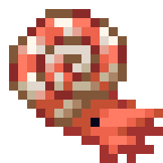 앵무조개의 숨결 (Breath of the Nautilus) | 현재 산소가 줄지 않게 하지만 이미 줄어든 산소를 채우지는 않습니다. | 길들인 앵무조개 탑승 |
| 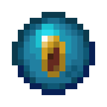 전달체의 힘 (Conduit Power) | 물속에서 수중 호흡·야간 투시·채굴 속도 증가에 해당하는 능력을 제공합니다. | 활성화된 전달체 범위에서 물이나 비에 접촉 |
| 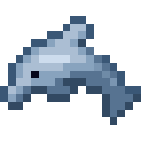 돌고래의 가호 (Dolphin's Grace) | 헤엄치는 속도를 크게 높입니다. | 돌고래 가까이에서 수영; 깊은 바다 탐험 때 유용 |
| 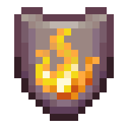 화염 저항 (Fire Resistance) | 불·용암·마그마·화염구 피해를 막지만 공허나 일부 특수 피해는 막지 않습니다. | 포션, 불사의 토템, 피글린 교환 포션 |
|  발광 (Glowing) | 개체 윤곽을 벽 너머에서도 보이게 합니다. | 분광 화살, 종으로 드러난 습격대 |
|  성급함 (Haste) | 채굴 속도와 공격 속도를 높입니다. | 신호기 |
| 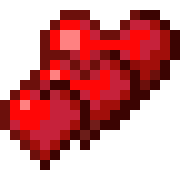 생명력 강화 (Health Boost) | 최대 체력을 늘립니다. 효과 종료 시 추가 최대 체력도 사라집니다. | 주로 명령어·커스텀 콘텐츠 |
|  마을의 영웅 (Hero of the Village) | 주민 거래 가격을 할인하고 주민 선물을 받을 수 있게 합니다. | 습격 승리 |
| 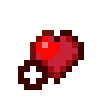 즉시 치유 (Instant Health) | 즉시 체력을 회복합니다. 언데드에게는 피해를 줍니다. | 치유 포션, 치유 화살 |
|  투명 (Invisibility) | 몸을 보이지 않게 하지만 착용 장비·든 아이템·입자는 보일 수 있습니다. 몹 탐지 거리도 줄어듭니다. | 투명화 포션 |
|  점프 강화 (Jump Boost) | 점프 높이를 높이고 낙하 피해를 줄입니다. | 도약 포션, 신호기 |
| 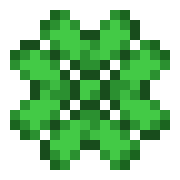 행운 (Luck) | `luck`을 사용하는 전리품 표의 품질 계산을 높입니다. 일반 생존에서 영향 범위는 제한적입니다. | 26.1 바닐라에서는 주로 명령어 |
|  야간 투시 (Night Vision) | 어두운 곳과 물속을 밝게 보이게 합니다. | 야간 투시 포션 |
|  재생 (Regeneration) | 일정 간격으로 체력을 회복합니다. | 재생 포션, 황금 사과, 불사의 토템, 신호기 |
| 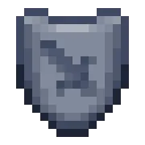 저항 (Resistance) | 공허·굶주림 등 일부를 제외한 받는 피해를 단계마다 줄입니다. | 신호기, 거북 도사의 물약, 마법이 부여된 황금 사과 |
| 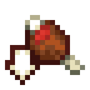 포화 (Saturation) | 허기와 포화도를 즉시 회복합니다. | 특정 수상한 스튜, 명령어 |
| 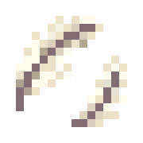 느린 낙하 (Slow Falling) | 낙하 속도와 낙하 피해를 없애며 달리면서 점프할 수 없게 합니다. | 느린 낙하 포션 |
| 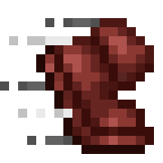 속도 증가 (Speed) | 걷기·달리기 이동 속도와 시야각을 높입니다. | 신속 포션, 신호기 |
| 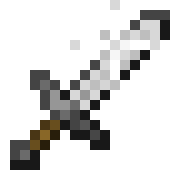 힘 (Strength) | 근접 공격 피해를 높입니다. | 힘 포션, 신호기 |
| 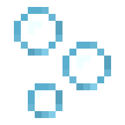 수중 호흡 (Water Breathing) | 산소가 줄지 않아 익사하지 않게 합니다. | 수중 호흡 포션, 거북 등딱지 착용의 짧은 효과 |

## 해로운 효과

| 한국어 (English) | 효과 | 대표 획득처·대응 |
|---|---|---|
| 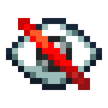 실명 (Blindness) | 시야를 매우 짧게 제한하고 달리기와 치명타 공격을 막습니다. | 수상한 스튜 등; 우유로 제거 |
| 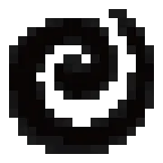 어둠 (Darkness) | 화면 밝기를 주기적으로 낮추며 야간 투시와 함께 있어도 시야를 방해합니다. | 스컬크 비명체·워든 |
| 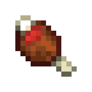 허기 (Hunger) | 행동할 때 허기 소모를 빠르게 만듭니다. | 썩은 살, 허스크 공격, 복어 등 |
| 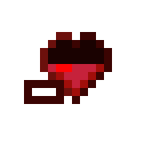 즉시 피해 (Instant Damage) | 즉시 마법 피해를 줍니다. 언데드는 오히려 회복합니다. | 고통의 포션·화살 |
|  공중 부양 (Levitation) | 개체를 위로 띄워 종료 뒤 낙하 위험을 만듭니다. | 셜커 탄환 |
| 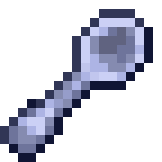 채굴 피로 (Mining Fatigue) | 채굴 속도와 공격 속도를 크게 낮춥니다. | 엘더 가디언; 우유로 제거 |
| 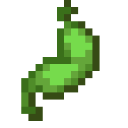 멀미 (Nausea) | 화면을 흔들고 왜곡합니다. 접근성 설정에서 왜곡 강도를 낮출 수 있습니다. | 복어, 네더 포털 체류 등 |
| 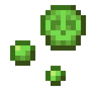 독 (Poison) | 주기적으로 피해를 주지만 일반적인 독만으로는 체력이 1 아래로 내려가지 않습니다. | 독 포션, 동굴 거미, 벌, 복어; 꿀 또는 우유 |
| 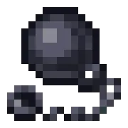 속도 감소 (Slowness) | 이동 속도와 시야각을 낮춥니다. | 감속 포션, 스트레이 화살, 거북 도사의 물약 |
| 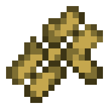 불운 (Bad Luck) | `luck` 기반 전리품 계산을 낮춥니다. 일반 생존에서 영향 범위는 제한적입니다. | 주로 명령어 |
| 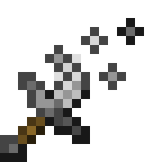 나약함 (Weakness) | 근접 공격 피해를 낮춥니다. | 나약함 포션·화살; 좀비 주민 치료에 사용 |
| 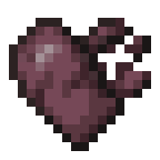 시듦 (Wither) | 체력 표시를 검게 만들고 주기적으로 피해를 주며 독과 달리 사망시킬 수 있습니다. | 위더·위더 스켈레톤, 위더 장미, 수상한 스튜 |

## 시련·사망 반응 효과

| 한국어 (English) | 효과 | 획득·활용 |
|---|---|---|
| 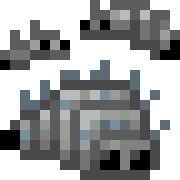 벌레 먹음 (Infested) | 피해를 받을 때 10% 확률로 좀벌레 1~2마리를 생성하며 단계는 확률·마릿수를 바꾸지 않습니다. | 어색한 물약+돌로 양조; 좀벌레는 면역 |
| 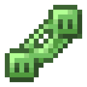 점액화 (Oozing) | 사망 시 크기 2 슬라임 두 마리를 생성하되 주변 슬라임·개체 밀집 제한을 따릅니다. 단계는 마릿수를 바꾸지 않습니다. | 어색한 물약+슬라임 블록; 슬라임은 면역 |
| 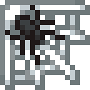 방적 (Weaving) | 사망 시 1블록 안에 거미줄 2~3개 배치를 시도하고 거미줄 감속을 완화합니다. 단계는 바꾸지 않습니다. | 어색한 물약+거미줄; 플레이어가 아닌 개체는 `mobGriefing` 적용 |
| 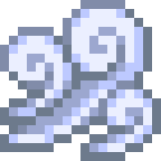 돌풍 (Wind Charged) | 사망 시 `3.0` 이상 `5.0` 미만의 무작위 위력으로 돌풍 폭발을 만들며 단계는 위력을 바꾸지 않습니다. | 어색한 물약+브리즈 막대 |

이 네 효과는 불길한 시련 생성기가 던지는 물약에서도 만날 수 있습니다. 농장에
이용할 때는 생성되는 슬라임·좀벌레·거미줄이 주변 시설을 망가뜨리지 않게 격리하세요.

## 불길한 징조 계열

| 한국어 (English) | 작동 방식 |
|---|---|
| 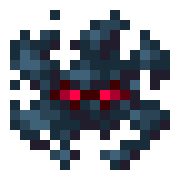 흉조 (Bad Omen) | 불길한 병을 마시면 I~V 단계로 1시간 40분 동안 받습니다. 마을에 들어가면 습격 징조로, 활성 가능한 시련 생성기에 접근하면 시련 징조로 변합니다. |
| 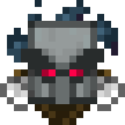 습격 징조 (Raid Omen) | 흉조가 마을에서 변환된 30초 준비 효과입니다. 끝나면 그 위치에서 습격이 시작되며, 끝나기 전에 우유로 취소할 수 있습니다. |
| 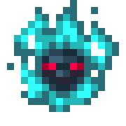 시련 징조 (Trial Omen) | 흉조가 시련의 회당에서 변환됩니다. 지속 시간은 변환된 흉조 단계당 15분이며, 감지한 시련 생성기를 불길하게 바꿉니다. |

## 신호기 단계

신호기 1단은 속도 증가·성급함, 2단은 저항·점프 강화, 3단은 힘을 선택지에 더합니다.
완전한 4단 피라미드는 선택한 기본 효과를 II로 강화하거나 재생 I을 보조 효과로
고를 수 있습니다. 전달체의 힘은 신호기 효과가 아니라 별도의 전달체 범위 효과입니다.

양조 재료와 정확한 포션 변환은 [양조법](brewing.md), 허기와 포화 수치는
[음식](food.md)을 참고하세요.

## 조사 기준

- [Minecraft Java Edition 26.1 릴리스 노트](https://feedback.minecraft.net/hc/en-us/articles/44551668333837-Minecraft-Java-Edition-26-1)
- [Minecraft Java Edition 1.21.11: 앵무조개의 숨결](https://www.minecraft.net/en-us/article/minecraft-java-edition-1-21-11)
- [Minecraft 24w13a: 징조와 신규 상태 효과](https://www.minecraft.net/en-us/article/minecraft-snapshot-24w13a)
- [Minecraft 26.1 생성 레지스트리](https://github.com/misode/mcmeta/blob/26.1-summary/registries/data.json)
